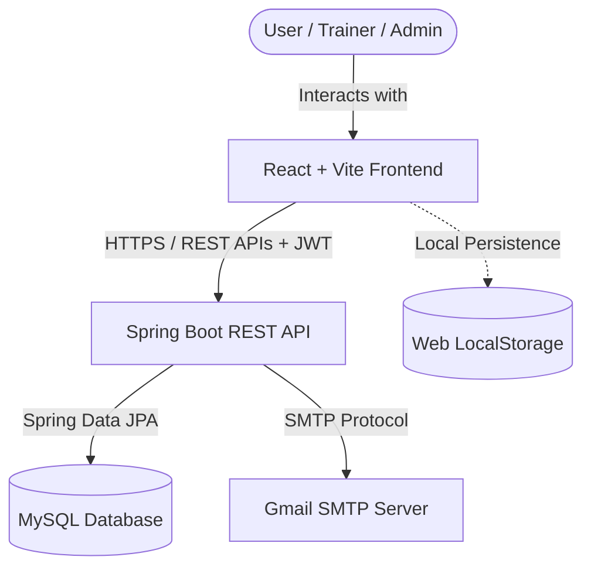

# 🌿 WellNest — Health & Wellness Portal

WellNest is a premium, feature-rich health and wellness portal designed to help users track their daily physical activities, plan diets, analyze body composition, read wellness articles, and connect with certified fitness coaches. Built using a modern **React SPA frontend** and a secure **Spring Boot backend**, WellNest offers a highly interactive experience complete with an AI-driven chat guide, personalized recommendation engines, and distinct roles for users, trainers, and administrators.

---

## 🚀 Technical Architecture

WellNest uses a decoupled client-server architecture:



*   **Frontend**: React (v19) SPA built with Vite. It features custom-designed glassmorphic dark-themed layouts, dynamic visualizations, and local state persistence for daily progress tracking.
*   **Backend**: Java (v17) Spring Boot Web Application utilizing Spring Security for secure endpoints (JWT authentication) and Spring Data JPA for persistence.
*   **Database**: MySQL. Schema tables are automatically initialized and updated on startup via Hibernate DDL auto-configuration.
*   **Notifications**: Integrated SMTP mail client to support OTP-based registration and password resets.

---

## ✨ Key Features & Functionalities

### 1. 📊 User Activity Trackers
*   **💧 Hydration Tracker**: Log water intake (and other beverages like coconut water or smoothies) throughout the day against a personalized 2.5-liter daily target, tracking percentages and history.
*   **🚶 Walking & Step Tracker**: Count daily steps, log duration and distance, and view calories burned.
*   **🧘 Yoga & Flexibility Companion**: View structured yoga routines, track stretch durations, and log completed sessions.
*   **🥗 Diet & Nutrition Planner**: Plan daily calorie budgets (default: 2000 kcal). Quick-add standard meals (Dal & Rice, Oatmeal, Grilled Chicken, etc.) or log custom food items with exact macros (Protein, Carbs, Fats).
*   **🔄 Daily Refresh**: Utilizes a custom hook (`useDailyLogs`) which automatically archives and resets active tracking metrics at the start of each new day to encourage consistent habits.

### 2. ⚖️ Smart BMI Calculator & Recommendations
*   Supports both **Metric** (cm/kg) and **Imperial** (inches/lbs) units.
*   Instantly calculates Body Mass Index (BMI) and places users into defined weight categories (Underweight, Normal, Overweight, Obese).
*   Generates a custom list of health tips and filters certified personal trainers in the system who specialize in the user's specific weight-management targets.

### 3. 🕵️‍♂️ Personal Coach Matcher
*   Algorithmic matching system that takes input on user goals (e.g. Strength Training, Weight Loss, Flexibility) and schedule availability (e.g., Morning, Evening, Weekends).
*   Recommends the best matching fitness trainers and allows direct appointment requests.

### 4. 🌿 Contextual AI Chat Guide
*   An interactive chatbot with contextual session memory.
*   Users can provide metrics in natural language (e.g., *"I am 70kg and 180cm"*), and the assistant calculates BMI.
*   Suggests daily water intake targets, customized protein/calorie requirements, and specific styles of yoga depending on the calculated BMI.
*   Provides action buttons that navigate the user directly to the relevant tracker page.

### 5. ✍️ Community Feed & Health Blog
*   Read health tips, wellness guidelines, and articles written by professional trainers.
*   Includes full CRUD capabilities (create, read, edit, delete articles), tagging systems, liking mechanisms, and interactive comment threads.

### 6. 👥 Role-Based Portals & Dashboards
*   **User Portal**: Standard access to all activity logs, trackers, the AI chatbot, blogs, and trainer matching.
*   **Trainer Portal**: Custom sidebar layout for coaches to review client appointments, update profiles, publish health articles, and answer queries.
*   **Admin Dashboard**: Administration panel displaying real-time system metrics (total users, active trainers, total articles, and overall system health). Allows viewing all registered users and deleting accounts.

---

## 📁 Directory Structure

```text
wellnest/
├── backend/
│   ├── src/main/java/com/wellnest/
│   │   ├── config/          # CORS, Security, and Database seeding configurations
│   │   ├── controller/      # API endpoints (Auth, Admin, Blog, Trainers, Feed)
│   │   ├── model/           # JPA entities (User, Blog, Comment, Post)
│   │   ├── repository/      # Spring Data JPA Repository interfaces
│   │   ├── security/        # JWT utilities, filters, and UserDetails services
│   │   └── service/         # Business logic layer
│   │   └── WellnestApplication.java  # Main application entrypoint
│   ├── src/main/resources/
│   │   └── application.properties    # Server, Database, SMTP, and JWT keys
│   └── pom.xml              # Maven dependencies
├── frontend/
│   ├── src/
│   │   ├── assets/          # Static files
│   │   ├── AuthContext.jsx  # Authentication state & server communication
│   │   ├── useDailyLogs.js  # LocalStorage tracker synchronization hook
│   │   ├── App.jsx          # Route mapping and layout wrappers
│   │   ├── main.jsx         # React application entrypoint
│   │   ├── index.css        # Premium styling sheet
│   │   └── [Components].jsx # Pages (Dashboard, BMICalculator, Chatbot, etc.)
│   ├── index.html
│   ├── package.json         # NPM scripts and React dependencies
│   └── vite.config.js       # Vite build configurations
└── README.md
```

---

## 🛠️ Installation & Setup Guide

### Prerequisites
*   **Java Development Kit (JDK) 17** or higher
*   **Node.js** (v18.x or higher) & **npm**
*   **Maven** (installed and added to system path)
*   **MySQL Server** running locally

---

### Step 1: Database Setup
1. Open your MySQL command-line tool or administration interface (like MySQL Workbench).
2. Create a database named `wellnest_db`:
   ```sql
   CREATE DATABASE wellnest_db;
   ```
3. Open `backend/src/main/resources/application.properties` and verify/update your database credentials:
   ```properties
   spring.datasource.url=jdbc:mysql://localhost:3306/wellnest_db?useSSL=false&allowPublicKeyRetrieval=true&serverTimezone=UTC
   spring.datasource.username=YOUR_MYSQL_USERNAME
   spring.datasource.password=YOUR_MYSQL_PASSWORD
   ```

---

### Step 2: Running the Spring Boot Backend
1. Open a terminal and navigate to the `backend` folder:
   ```bash
   cd backend
   ```
2. Build the project using Maven:
   ```bash
   mvn clean install
   ```
3. Start the application:
   ```bash
   mvn spring-boot:run
   ```
4. The backend server will start on **`http://localhost:8080`**. Database tables will be automatically generated.

---

### Step 3: Running the React Frontend
1. Open a new terminal and navigate to the `frontend` folder:
   ```bash
   cd frontend
   ```
2. Install the required NPM packages:
   ```bash
   npm install
   ```
3. Run the development server:
   ```bash
   npm run dev
   ```
4. The client will start on **`http://localhost:5173`** (or another port outputted in the terminal). Open this URL in your web browser.

---

## 🔑 Default Accounts (Seeded Data)

The backend comes pre-configured with a database seeder (`DatabaseSeeder.java`) that registers default credentials on startup for testing various portal roles.

### 1. System Administrator
*   **Email**: `admin@gmail.com`
*   **Password**: `admin`
*   **Role**: Admin
*   *Provides access to the Admin Dashboard (Stats, User Management).*

### 2. Certified Fitness Coaches (Trainers)
*   **Default Password**: `trainer123` (for all trainers listed below)
*   **Role**: Trainer
*   *Provides access to the Trainer Sidebar and personalized dashboard.*

| Trainer Name | Email Address | Specialty |
| :--- | :--- | :--- |
| **Priya Sharma** | `priya.sharma@gmail.com` | Weight Loss & Nutrition |
| **Arjun Mehta** | `arjun.mehta@gmail.com` | Strength & Muscle Building |
| **Sneha Patel** | `sneha.patel@gmail.com` | Yoga & Flexibility |
| **Ravi Kumar** | `ravi.kumar@gmail.com` | Cardio & Endurance |
| **Ananya Singh** | `ananya.singh@gmail.com` | Posture & Rehab |
| **Karan Joshi** | `karan.joshi@gmail.com` | General Fitness & Lifestyle |

### 3. Creating a User Account
To test the standard user tracker functionalities:
1. Click **Register** on the login page.
2. Enter your details and verify your email.
3. Once registered, log in to access the central User Dashboard.
